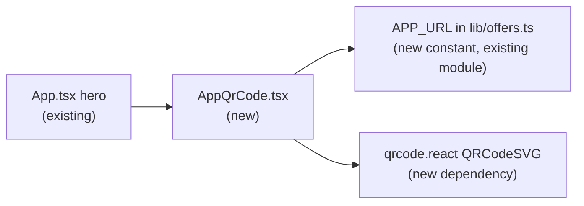

# Scannable QR code on the home page for the app URL

Source issue: [#19](https://github.com/pkarw/openmercato-livecoding-landingpage/issues/19)

## 📝 TLDR

Someone reading this landing page on a screen that is not theirs — a projector during a live session, a colleague's laptop, a screenshot — cannot reach it on their own phone without retyping a 78-character UUID hostname. This spec proposes adding a QR code to the hero that encodes the deployment URL, rendered client-side with no third-party request, shown only at `md` and wider, and paired with a real clickable link so keyboard, screen-reader, and copy-paste users are never dependent on a camera. Everything below is proposed behavior; none of it exists in the repository today.

## 📝 Problem Statement

The deployment is served at:

```
https://app-54e0f829-998a-4972-a681-23fc364f32e8.apps-v2.openmercatocloud.com/
```

78 characters, of which 36 are a UUID with nothing memorable or guessable in it. Verified during triage: that URL answers `HTTP 200` and its `<title>` matches `client/index.html` exactly, so it is this repository's own deployment and a correct QR target.

The page exists to capture leads inside a closing offer window (`README.md`, "What it does"). Every viewer who cannot get to the page on a device they can type into is a lead the form never sees. The audience that hits this is specifically the one the page is shown *to* rather than browsed *by*: a live-session or demo audience looking at a projector.

Not verified: nothing QR-related exists anywhere under `client/` today (`grep -i qr` over the working tree returns only an unrelated alphabet constant in `server/Models/Lead.cs`), so no rendering or scan behavior has been observed — only designed.

## Resolved assumptions (autonomous defaults)

Written under `om-spec-writing --autonomous`; each answer is the most reversible option that still ships something working. Override any of them before merge.

| # | Question | Chosen answer | Rationale |
|---|----------|---------------|-----------|
| Q1 | Hardcode the deployment URL, or derive it from `window.location.origin`? | **Hardcode** as `APP_URL` in `client/src/lib/offers.ts`, with a comment naming it deployment-specific. | This is what issue #19 asked for, and it matches the repository's existing pattern — `PRIVACY_URL` is a module constant and there is no `import.meta.env` or `VITE_*` usage anywhere under `client/`. `window.location.origin` self-heals across redeployments but only ever encodes the host the viewer is already on, so it is equivalent while there is a single deployment and silently wrong if the code is ever screenshotted from a preview or staging host. One constant, one line to change. |
| Q2 | New `qrcode.react` dependency, or a pre-rendered SVG committed under `client/public/`? | **`qrcode.react` 4.2.0**, rendering `QRCodeSVG`. | A new runtime dependency is real added surface, but the alternatives are worse: a committed pre-rendered SVG is generated by a tool that lives outside the repo and goes stale silently the moment `APP_URL` changes, and vendoring an encoder adds several hundred lines of unreviewed code. `qrcode.react` is ISC, has **zero runtime dependencies**, declares `react: ^19.0.0` in its peer range, and emits inline SVG — no request at page load. Reversing it is deleting one import and one dependency line. |
| Q3 | Hero (below `<Countdown />`) or footer? | **Hero**, inside the existing `mt-10 flex flex-col items-center gap-5` block, gated `hidden md:flex`. | Where the ticket asked for it, and where a projector audience is looking. The footer is the documented fallback if the hero turns out too tall — a one-line move, and both placements satisfy the acceptance criteria. |
| Q4 | Who is the scanner? | **A person looking at this page on a screen they cannot type into** (projector, someone else's laptop, a screenshot). ⚠ **NEEDS HUMAN CONFIRMATION** | Issue #19 raises this itself: the originating brief never named the audience. If the real intent is a QR for a *printed* slide or leaflet, or a code pointing somewhere other than this page, then both Q1 (a print asset outlives a deployment id, so hardcoding gets worse) and Q3 (print needs a footer/asset, not a `hidden md:flex` hero block) flip. The design below is coherent only under the on-screen reading, so this one gates merge rather than being a silent default. |

## 📝 Proposed Solution

Three changes, all inside `client/`:

1. **`APP_URL` constant** in `client/src/lib/offers.ts`, beside `PRIVACY_URL` (line 68).
2. **`client/src/components/AppQrCode.tsx`** — one presentational component: a card in the existing house style with the code on a white padded tile, a short "Scan to open on your phone" label, and the host as a real link underneath.
3. **One placement** in `client/src/App.tsx`, in the hero's `mt-10 flex flex-col items-center gap-5` block after `<Countdown />` (`App.tsx:94-112`), gated `hidden md:flex`.

Nothing under `server/`, no `/api` change, no schema, no change to the offer, claim, or email flows.

### Alternatives considered

- **External QR image service** (`api.qrserver.com` and friends) — rejected. It adds a third-party request to every page load and fails on exactly the flaky conference Wi-Fi where this feature earns its keep. Issue #19 rules it out explicitly.
- **Pre-rendered committed SVG** — rejected, see Q2. Kept as the fallback if the team decides the dependency is not worth it; the component boundary means only `AppQrCode.tsx` would change.
- **`window.location.origin`** — rejected, see Q1.

## 📝 Architecture

One new leaf component with no state, no effects, and no data flow. It does not touch `api.ts`, the offer state in `App.tsx`, or any shared context — `App.tsx` mounts it and passes nothing.



Takeaway: the blast radius is one import line in `App.tsx`. Every other consumer of `offers.ts` (`OfferPicker`, `ClaimForm`, `App`) is additive-only — a new named export cannot break them.

The component reuses the repository's established primitives rather than inventing parallel ones: the card surface copies the claim panel's `rounded-2xl border border-border bg-card` (`App.tsx:134`), spacing and muted type follow `Countdown.tsx`, and `cn()` from `@/lib/utils` handles the optional `className` the same way `Countdown` does. No new shadcn/ui component is added — `ui/card.tsx` exists but the hero uses raw utility classes, so the QR card matches the hero, not the registry.

## 📝 Data Model

None. No entity, field, migration, or stored value; the QR payload is a compile-time constant. No PII is involved — nothing about the visitor is encoded, read, or transmitted.

## 📝 API Contracts

None. `server/` and `/api` are untouched.

## 📝 UI/UX

**Placement and visibility.** Hero, after `<Countdown />`, inside the existing centered column. Gated `hidden md:flex`: a visitor on a phone is already on the page on the device they would scan with, and the hero must not get crowded on mobile.

**Composition** (top to bottom inside one `rounded-2xl border border-border bg-card` card):

1. A white tile (`bg-white`, `rounded-xl`, padding) holding the code. The tile is explicit white, not `bg-card` — `client/index.html` hardcodes `class="dark"` on `<html>`, so the page has exactly one theme and a token-driven surface here would be `#1a1919`. Dark-on-dark and inverted (light-on-dark) QR codes are rejected by a large share of phone scanners, which assume a dark-on-light code.
2. A short label — "Scan to open on your phone" — so the graphic's purpose is readable without scanning it.
3. The host as a real `<a href={APP_URL}>` in muted type.

**Rendering requirements** (these are the acceptance-relevant properties, not prop trivia):

- **Dark modules on a light field.** `fgColor` a near-black from the palette (`#141313`), `bgColor` `#ffffff`.
- **Quiet zone ≥ 4 modules** around the symbol — the ISO minimum. `QRCodeSVG`'s `marginSize={4}` supplies it; the tile's own padding is visual breathing room on top, not a substitute.
- **Module size ≥ 4 CSS px.** The payload is 78 bytes, which at error-correction level `M` is QR version 4 (33×33 modules) or 5 (37×37). With `marginSize={4}` the symbol is ~41–45 units across, so a rendered `size={176}` gives ~4px per module — the practical floor for a phone camera reading a projected or photographed screen.
- **Error correction `M`** (the default). `H` is only worth its density cost when a logo is overlaid on the code, which is a non-goal here; higher correction means more modules in the same box, which is the wrong trade on a low-resolution projector.
- **No network at page load.** `QRCodeSVG` emits inline SVG paths; nothing is fetched.

**Accessibility.** The graphic carries `role="img"` and an `aria-label` naming where it leads (e.g. `QR code linking to app-…​.apps-v2.openmercatocloud.com`). The adjacent `<a>` is the real, focusable, copy-pasteable path to the same destination, so the feature is never camera-only. Contrast is not a concern inside the white tile; the surrounding card reuses tokens already in use on this page.

**States.** The component is stateless and has no loading, error, or empty state — it renders the same markup on every visit. Note that the hero sits outside the `live` conditional in `App.tsx`, so the code stays on the page after the offer window closes; that is correct, since the URL still resolves.

## 📝 Research — what the market does

The comparable pattern is "open this local/ephemeral URL on your phone": Vite's `--host` QR plugins, ngrok's dashboard, Expo Go, and Wi-Fi-credential QR codes. What they consistently get right, and this spec adopts:

- **Render locally, never via an image service** — the code must work on the bad network that made the QR necessary.
- **Always show the URL as text beside the code** — a scan that fails must leave a path forward.
- **A light quiet zone regardless of the app's theme** — every one of these renders dark-on-light even inside dark UIs.
- **Label the code's purpose in one short line** — an unlabeled QR on a slide is routinely ignored.

Complexity they carry that this can skip: dynamic short-link indirection with scan analytics (Bitly and QR-SaaS vendors) needs a redirect service and a privacy story for a single-page lead magnet; logo-in-the-middle branding at error correction `H` buys nothing on a projector; per-session codes (Expo, ngrok) are pointless against one stable URL.

**One thing the leaders do that this spec deliberately defers:** tagging the QR payload so scan traffic is distinguishable — `?src=qr` or a UTM parameter. It is one constant away and would answer "did anyone actually scan it", but issue #19 names scan tracking a non-goal, and it would make the encoded URL differ from the link shown beside it, which is its own small honesty problem. Recorded here as the obvious follow-up rather than smuggled into scope.

## 📝 Edge Cases & Failure Scenarios

| Scenario | Behavior |
|---|---|
| The deployment is rebuilt under a new app id | The QR and the link both point at a dead host, silently. Mitigation is containment, not detection: the URL lives in exactly one constant with a comment naming it deployment-specific. Accepted risk — see Q1. |
| Viewport below `md` | The block is not rendered (`hidden md:flex`). Intended: the visitor is already on the device they would scan with. |
| A screenshot taken at phone width | Contains no QR code, because the breakpoint gate removed it. This partially misses one of the triggers named in the TLDR — the screenshot case only works when the screenshot was taken at `md` or wider (a desktop or projector capture, which is the common case). Accepted: relaxing the gate would crowd the mobile hero, which the ticket rules out. |
| A scanner rejects the code | The `<a>` beside it is the fallback, as is the `aria-label`. This is the reason both exist. |
| Screen reader or keyboard-only user | Never reaches a dead end: the link is a normal focusable anchor, and the graphic announces its destination. |
| Offer window closed | The hero renders unconditionally, so the code remains. Correct — the URL still resolves. |
| Page is printed, or the browser blocks SVG | Out of scope; no print stylesheet exists in this repository today and none is proposed. |
| `qrcode.react` fails to resolve at build time | `npm --prefix client run build` fails loudly in CI. There is no runtime failure mode to design for — the encoding happens in the bundle, not at page load. |

## 📝 Risks & Impact Review

- **New runtime dependency** (`qrcode.react` 4.2.0, ISC, zero transitive runtime deps, ~115 KB unpacked). This is the only item in this spec that widens the project's surface. It is reversible in one commit, and the component boundary means swapping in a pre-rendered SVG later touches one file. `client/package-lock.json` changes as a consequence.
- **Hardcoded deployment host** — a factual, accepted fragility (Q1), contained to one constant.
- **Nothing hard to reverse otherwise.** No public contract, schema, default, config format, or stored data changes. `server/` is untouched, so no API consumer is affected. There is no `BACKWARD_COMPATIBILITY.md` in this repository and no protected surface is in play.
- **Product direction, not a defect:** Q4's audience assumption. If it is wrong, this is the wrong feature shape — not a bug in the design below. It is marked as a merge gate for that reason.
- **Validation ceiling:** `SDLC.md` § Validation records that this repository has no test suite. Verification is therefore the configured gate (`npm --prefix client run typecheck`, `npm --prefix client run build`, `bash scripts/dotnet.sh build server --no-restore`) plus visual evidence and one manual phone scan. No automated regression protects this component; a future refactor can remove it silently.

## 📋 Phasing

One phase. The capability is a single independently deployable change and splitting it would ship a dependency nobody imports.

## 📋 Implementation Plan

### Phase 1 — Scannable QR in the hero

**Step 1 — Add the renderer dependency.**
Add `qrcode.react@^4.2.0` to `client/package.json` dependencies and update `client/package-lock.json`.
*Verified by:* `npm --prefix client run typecheck` and `npm --prefix client run build` both pass; the lockfile records `qrcode.react` 4.2.x with no new transitive runtime dependency. The app is unchanged and working.

**Step 2 — Add `APP_URL` and the `AppQrCode` component.**
Export `APP_URL` from `client/src/lib/offers.ts` beside `PRIVACY_URL`, with a comment marking it deployment-specific. Create `client/src/components/AppQrCode.tsx` per § UI/UX: `QRCodeSVG` with `size={176}`, `marginSize={4}`, `level="M"`, `fgColor="#141313"`, `bgColor="#ffffff"` on a white padded tile inside a `rounded-2xl border border-border bg-card` card, with the label, `role="img"` + `aria-label`, and the `<a href={APP_URL}>`. Accept an optional `className` through `cn()`, matching `Countdown`.
*Verified by:* `npm --prefix client run typecheck` passes. The component is not yet mounted, so the app still builds and runs exactly as before.

**Step 3 — Mount it in the hero and verify.**
Import and render `<AppQrCode className="hidden md:flex" />` in `client/src/App.tsx`, in the `mt-10 flex flex-col items-center gap-5` block after `<Countdown />`.
*Verified by:* the full validation gate from `SDLC.md` § Validation; a screenshot of the hero at ≥ `md` width showing a dark-on-light code and the link; a screenshot below `md` showing it absent; a DevTools network check confirming no QR-related request at page load; and one manual phone scan resolving to `https://app-54e0f829-998a-4972-a681-23fc364f32e8.apps-v2.openmercatocloud.com/` and opening this landing page.

### Follow-up, not in scope

Tagging the QR payload (`?src=qr` / UTM) so scan traffic is measurable — see § Research. Requires reopening the "no scan tracking" non-goal in issue #19.
