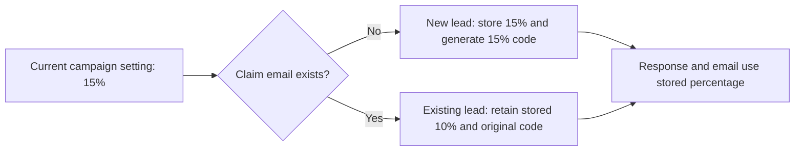

# Increase the Offer Discount to 15%

## 📝 TLDR

Prospective customers currently see and reserve a 10% discount for Open Mercato Cloud, AI Tech Leaders, or both. The future behavior will advertise and reserve 15% for reservations created after rollout, while existing reservations retain their original 10% entitlement on repeat submissions and in email copy. The deadline and product eligibility remain unchanged.

## 📝 Problem Statement

The campaign percentage is currently read from `OFFER_DISCOUNT_PERCENT`, but each generated code embeds that percentage and duplicate emails deliberately keep their first code. Changing only the global setting would create contradictory behavior: the landing page and `POST /api/leads` response could promise 15% to a returning lead whose stored code is still worth 10%.

The percentage also has independent fallbacks and static references in the API, React client, page metadata, local/test environment configuration, and documentation. These must change together so API failures, link previews, and operator setup do not keep advertising 10%.

## 📝 Proposed Solution

Treat the campaign setting as the percentage offered to a **new** reservation and snapshot that percentage on the lead when the reservation is created. New codes and new lead records receive 15%; an email address that already exists keeps its stored code and stored 10% percentage. All confirmation responses and emails read the percentage from the reservation, while `GET /api/offer` continues to describe the currently available campaign.

Add a dedicated `discount_percent` field rather than parsing the percentage from `discount_code`. The code remains an opaque redemption credential, and the explicit field becomes the source of truth for customer messaging and later fulfillment.

This follows the useful part of established open-source commerce designs: [Saleor materializes an applied promotion as an order or line discount](https://github.com/saleor/saleor/issues/14586), and [Medusa stores applied adjustments separately from the live promotion definition](https://github.com/medusajs/medusa/blob/develop/packages/modules/cart/src/models/line-item-adjustment.ts). Their campaign-rule, stacking, tax, and budget machinery is unnecessary for this single campaign.

## 📝 Architecture

`OfferSettings` remains the source for the active campaign percentage. `LeadRepository.ClaimAsync` snapshots `OfferSettings.DiscountPercent` only on a successful insert; its conflict path returns the existing lead without changing either `discount_code` or `discount_percent`. `LeadEndpoints` and `LeadNotifier` then use the returned lead's percentage for reservation-specific output.

The client still obtains the current public offer through `GET /api/offer`. After a claim, it renders the percentage returned by `POST /api/leads`, allowing a returning 10% lead to see the entitlement actually attached to that address even while the landing page advertises 15%.

The stored reservation, rather than the mutable campaign setting, determines what a specific claimant is promised.

## 📝 Data Model

Add `leads.discount_percent integer` through two forward-only migrations. The Phase 1 migration adds the column as non-null with a temporary default of `10` and backfills every existing row, keeping the currently deployed application able to insert leads during rollout. After every application instance explicitly writes the percentage, the Phase 2 migration removes the database default so a missed write fails instead of silently reverting to 10%.

Extend `Lead` and the repository column mapping with `DiscountPercent`. Pass the active percentage into the insert alongside the generated code. The duplicate-email update must leave both discount fields unchanged.

No sensitive data handling changes. The first migration is additive and safe to apply before the Phase 1 application deployment. The default-removal migration must wait until no older application instance remains.

## 📝 API Contracts

`GET /api/offer` keeps its response shape. Its `discountPercent` becomes `15` after activation and means "the percentage offered to a new reservation now."

`POST /api/leads` keeps its request and response shapes. Its response `discountPercent` means "the percentage reserved for this email": `15` for a newly created post-rollout lead and `10` for an existing pre-rollout lead. `alreadyClaimed` continues to distinguish those cases. This is a backward-compatible semantic correction because consumers already receive a numeric percentage and need no request changes.

## 📝 UI/UX

Update the React fallback offer, HTML title, description, and Open Graph copy to 15%. Dynamic landing-page content continues to use `GET /api/offer`. The claimed state continues to use the claim response, so a returning lead is shown the retained 10% without a new warning or choice.

Update customer confirmation subject/body copy to read `lead.DiscountPercent`. Update the internal notification to include the reserved percentage beside the code so fulfillment staff can verify the entitlement without decoding the code string.

## 📝 Edge Cases & Failure Scenarios

- A repeat submission after rollout returns and emails the stored 10% reservation; it never relabels the original code as 15%.
- Two concurrent first submissions for one email may generate candidate codes, but the unique email constraint selects one stored reservation and the conflict path returns that same percentage and code semantics to both requests.
- If `GET /api/offer` fails, the client fallback advertises 15%, matching the server's new fallback configuration.
- A deployment-level `OFFER_DISCOUNT_PERCENT=10` overrides repository defaults. Activation therefore requires explicitly verifying or changing the deployed environment to `15`.
- Migration failure stops activation before the new application is deployed. The temporary database default keeps the existing application compatible with the additive Phase 1 column.
- The offer deadline, eligible products, one-reservation-per-email rule, and widening `interest` to `both` on repeat submission do not change.

## 📝 Risks & Impact Review

The main risk is inconsistent messaging during a partial rollout. Apply the Phase 1 migration, deploy the snapshot-aware application while the offer remains at 10%, verify that no older instance remains, and then remove the temporary database default. Only then deploy the aligned application and static assets with `OFFER_DISCOUNT_PERCENT=15` as one activation. Smoke checks must cover both a seeded existing address and a new address.

Rollback sets the active campaign and UI/static defaults back to 10% for future reservations. Reservations created at 15% remain 15%, just as pre-rollout reservations remain 10%; changing an already promised entitlement is outside rollback. The additive column can remain in place and requires no destructive down migration.

The change increases the commercial discount for new claimants. The product owner must ensure checkout or fulfillment systems honor the percentage encoded and stored for each reservation; those systems are outside this repository.

Under `SDLC.md`, this is a money-affecting change. It therefore requires independent review and negative-path integration coverage before merge; the preserved existing-reservation path, concurrent duplicate path, and staged-migration compatibility are the required negative cases.

## 🧪 Acceptance Criteria

- A new email submitted after activation receives a stored `discount_percent` of `15`, a code containing `15`, a claim response of `15`, and confirmation copy stating 15%.
- An existing pre-rollout email retains its original code and stored `discount_percent` of `10`; a repeat claim responds and sends confirmation copy with 10%.
- `GET /api/offer`, the live landing page, the client fallback, search metadata, social metadata, environment examples, generated test environment, and README all advertise 15%.
- No remaining customer-facing or operational default advertises 10%, except the migration backfill and documentation/tests explaining preserved pre-rollout reservations.
- The configured typecheck, client build, and server build all pass.
- An independent reviewer confirms the stored-entitlement behavior and rollout order, and the required negative-path integration checks pass.

## 📋 Phasing

**Phase 1 — Preserve reservation entitlements.** Add and backfill the explicit percentage snapshot, then make all reservation-specific responses and emails use it. This can ship before campaign activation without changing the public offer.

**Phase 2 — Activate and verify 15%.** Remove the temporary database default after Phase 1 is fully deployed, align runtime defaults, client fallback, metadata, test environment, and documentation, then deploy with the production setting at 15 and verify both new and returning paths.

## 📋 Implementation Plan

### Phase 1 — Preserve reservation entitlements

1. Add a migration that introduces `leads.discount_percent` as non-null with a temporary `10` default and backfills existing rows. Verify it against a database containing an existing lead and confirm the old server can still read and create claims after migration.
2. Extend `Lead`, `LeadRepository`, and the claim endpoint so inserts store the active percentage and duplicate claims return the stored percentage. Verify with API coverage that a seeded 10% lead stays 10% while a new lead created under a 15% setting is 15%, including concurrent duplicate submissions.
3. Change `LeadNotifier` to use the lead's stored percentage and include it in the inbox notification. Verify rendered subject/body output for an existing 10% lead and a new 15% lead without sending real email.

### Phase 2 — Activate and verify 15%

4. After all Phase 1 application instances are live, add and apply a second migration that removes the temporary `discount_percent` default. Verify a repository insert still succeeds because it supplies the percentage explicitly and a direct insert that omits it fails.
5. Change the server fallback, client fallback, `.env.example`, generated local test-environment value, HTML metadata, comments, and README from the active 10% offer to 15%. Verify targeted search results contain no stale operational or customer-facing 10% reference.
6. Run `npm --prefix client run typecheck`, `npm --prefix client run build`, and `bash scripts/dotnet.sh build server --no-restore`. In the shared test environment, integration-test `GET /api/offer`, a new claim, a repeat claim for a pre-migration address, a concurrent duplicate claim, and compatibility at both migration boundaries. Obtain the independent review required by `SDLC.md` for money-affecting changes.
7. Set the deployed `OFFER_DISCOUNT_PERCENT=15`, deploy, and repeat the new/existing-address smoke checks. Record the previous environment value so runtime activation can be rolled back without altering stored entitlements.
