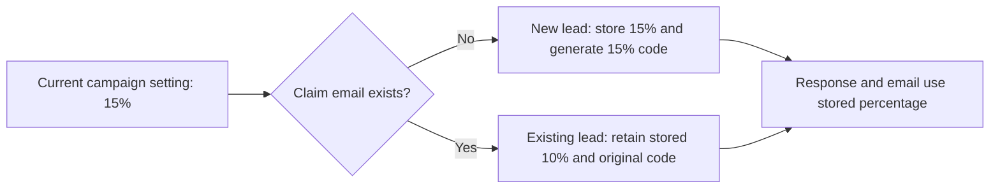

# Increase the Offer Discount to 15%

## 📝 TLDR

Prospective customers currently see and reserve a 10% discount for Open Mercato Cloud, AI Tech Leaders, or both. The future behavior will advertise and reserve 15% for reservations created after rollout, while existing reservations retain their original 10% entitlement on repeat submissions and in email copy. Product eligibility remains unchanged. **The campaign deadline is an open question — see below.**

## ❓ Open Questions

**Q1 (blocking) — does this campaign's deadline move, or does 15% belong to the next campaign?**

`OfferSettings.DefaultEndsAt` is `2026-09-20T23:59:59+02:00`, mirrored by `FALLBACK_OFFER.endsAt` in `client/src/App.tsx`, and `POST /api/leads` answers `410 Gone` once `IsActive` is false. This spec was written on 2026-09-19. Even with the single-deploy rollout below, implementation, the independent review `SDLC.md` requires for money changes, negative-path coverage, deployment, and smoke checks have to land inside roughly 40 hours — after which no lead can claim anything and 15% reaches nobody.

Three ways forward, none of which this document may decide on its own:

1. **Extend the campaign.** Set `OFFER_ENDS_AT` (and the two hard-coded fallbacks) to a new date, which is a commercial decision about how long the discount runs.
2. **Ship behind the current deadline.** Implement and deploy at 15% now, accepting that only the remaining window benefits.
3. **Retarget.** Treat 15% as the *next* campaign's rate: land the entitlement-snapshot work now (it is valuable on its own — it is what makes any future rate change safe) and flip `OFFER_DISCOUNT_PERCENT` when that campaign opens.

Everything else in this spec is written to hold under all three. Option 3 is the only one that removes the time pressure, because Phase 1 below is deadline-independent.

## 📝 Problem Statement

The campaign percentage is currently read from `OFFER_DISCOUNT_PERCENT`, but each generated code embeds that percentage and duplicate emails deliberately keep their first code. Changing only the global setting would create contradictory behavior: the landing page and `POST /api/leads` response could promise 15% to a returning lead whose stored code is still worth 10%.

The percentage also has independent fallbacks and static references in the API, React client, page metadata, local/test environment configuration, and documentation. These must change together so API failures, link previews, and operator setup do not keep advertising 10%.

## 📝 Resolved assumptions (autonomous defaults)

These were decided while drafting; each can be overridden without reworking the design.

- **Existing reservations keep 10%.** Retroactively upgrading pre-rollout leads is not proposed. Overriding this would replace the snapshot design with a simple setting change.
- **Rollback does not revoke promised percentages.** Reservations created at 15% stay at 15%.
- **A returning lead is told why they see 10%.** The original draft showed the retained percentage silently; this version adds explanatory copy (see UI/UX).
- **One migration, default retained permanently.** See Alternatives considered.
- **The offer deadline and product eligibility are unchanged by this spec.** The deadline's viability is Q1 above.

## 📝 Proposed Solution

Treat the campaign setting as the percentage offered to a **new** reservation and snapshot that percentage on the lead when the reservation is created. New codes and new lead records receive 15%; an email address that already exists keeps its stored code and stored 10% percentage. All confirmation responses and emails read the percentage from the reservation, while `GET /api/offer` continues to describe the currently available campaign.

Add a dedicated `discount_percent` field rather than parsing the percentage out of `discount_code`. `DiscountCodes.Generate` does embed the rate in the code prefix (`OMC15-XXXXXX`), and that stays — it is convenient for a human reading a code off an email. But the code is a redemption credential, not a data source: the explicit column is the single source of truth for customer messaging and later fulfillment, and nothing may parse the prefix to recover the percentage.

This follows the useful part of established open-source commerce designs: [Saleor materializes an applied promotion as an order or line discount](https://github.com/saleor/saleor/issues/14586), and [Medusa stores applied adjustments separately from the live promotion definition](https://github.com/medusajs/medusa/blob/develop/packages/modules/cart/src/models/line-item-adjustment.ts). Their campaign-rule, stacking, tax, and budget machinery is unnecessary for this single campaign.

### Alternatives considered

- **Change `OFFER_DISCOUNT_PERCENT` only.** Rejected: a returning 10% lead would be told 15% while holding an `OMC10-` code.
- **Parse the percentage from `discount_code`.** Rejected: it welds the credential format to business data, and any future code-format change silently corrupts entitlements.
- **Two staged migrations with a temporary default, removed once every instance writes the column explicitly.** Rejected — this was the original draft. It buys one thing: a missed write fails loudly instead of silently storing 10%. It costs a second migration, a second deployment, and an ordering constraint ("wait until no older application instance remains") that presumes a rolling multi-instance deploy. This repository has no Dockerfile, compose file, `fly.toml`, `Procfile`, or any orchestration manifest at any depth; `openmercato.toml` declares a single `[preview]` command and `scripts/serve.sh` ends in `exec` of one process. There is no second instance to be compatible with. The missed-write case is instead caught by the repository-insert test named in the plan below, at build time rather than in production — and on a money campaign, a claim that quietly reserves the older, cheaper rate is a better failure than a claim that 500s.

## 📝 Architecture

`OfferSettings` remains the source for the active campaign percentage. `LeadEndpoints` reads `offer.DiscountPercent` and passes it into `LeadRepository.ClaimAsync` as a parameter, exactly as it already passes the generated `discountCode`; the repository gains no configuration dependency. `ClaimAsync` stores that value only on a successful insert. Its conflict path reads the existing lead back and writes nothing, so neither `discount_code` nor `discount_percent` can be altered by a repeat claim. `LeadEndpoints` and `LeadNotifier` then use the returned lead's percentage for reservation-specific output.

> **Depends on PR #14** (`security(leads): stop anonymous duplicate claims from modifying existing leads`, issue #3). That PR replaces the conflict path's `update leads … returning` with a read-only `select` and removes the interest-widening and consent-OR behavior, because the claim endpoint is anonymous. This spec is written against the post-#14 shape — a read-only conflict path is what makes "a repeat claim cannot change a stored entitlement" true by construction rather than by convention. Implement this after #14 merges; if it is abandoned, the conflict path here must at minimum leave both discount columns untouched.

The client still obtains the current public offer through `GET /api/offer`. After a claim, it renders the percentage returned by `POST /api/leads`, allowing a returning 10% lead to see the entitlement actually attached to that address even while the landing page advertises 15%.

The stored reservation, rather than the mutable campaign setting, determines what a specific claimant is promised.

## 📝 Data Model

Add `leads.discount_percent integer not null default 10` in a single forward-only migration, `db/migrations/004_leads_discount_percent.sql`, matching the `00N_` naming already in that directory. PostgreSQL fills existing rows from the default in the same statement, so no separate backfill is needed. The default is **permanent**, not temporary: it records the pre-rollout entitlement for historical rows and keeps a forgotten write from failing a customer's claim. Nothing in the application relies on it — the repository always supplies the value explicitly, and a test asserts that.

Migrations are applied by `Migrator` in filename order (`StringComparer.Ordinal`), tracked with a checksum in `schema_migrations`. They run through `openmercato.toml`'s `prepare` hook (`bash scripts/serve.sh db migrate`) during deploy preparation, or standalone via `dotnet run --project server -- db migrate`. There is no automatic migration on application start — `Program.cs` only runs migrations when invoked with the `db` argument.

Extend the `Lead` record with `DiscountPercent` after `DiscountCode`, and add `discount_percent as DiscountPercent` to `LeadRepository.Columns`. That constant backs every read path (`FindByEmailAsync`, the insert's `returning`, and the conflict-path select), so one edit covers all of them.

No sensitive data handling changes. The migration is additive and safe to apply before the application deployment that starts writing the column.

## 📝 API Contracts

`GET /api/offer` keeps its response shape. Its `discountPercent` becomes `15` after activation and means "the percentage offered to a new reservation now."

`POST /api/leads` keeps its request and response shapes. Its response `discountPercent` is read from the stored lead rather than from `OfferSettings`, and means "the percentage reserved for this email": `15` for a newly created post-rollout lead and `10` for an existing pre-rollout lead. `alreadyClaimed` continues to distinguish those cases. This is a backward-compatible semantic correction because consumers already receive a numeric percentage and need no request changes.

## 📝 UI/UX

Update the React fallback offer, HTML title, description, and Open Graph copy to 15%. Dynamic landing-page content continues to use `GET /api/offer`. The claimed state continues to use the claim response.

**A returning pre-rollout lead will see two percentages on screen at once.** `ClaimedCard` replaces only the sidebar form; `App.tsx` keeps rendering `Take -{offer.discountPercent}%` in the hero and the `-{discountPercent}%` footnote from `GET /api/offer`. Post-rollout that means a 15% hero above a 10% card. On a money-affecting change, an unexplained discrepancy reads as being shortchanged, so `ClaimedCard` must state the reason when `alreadyClaimed` is true and the stored percentage is below the live offer — for example: *"You reserved your 10% earlier and that code stays valid."* No new choice or warning is offered; the point is that the number is explained, not negotiable.

Update customer confirmation subject/body copy to read `lead.DiscountPercent`. Both current uses of `offer.DiscountPercent` in `LeadNotifier` move to the lead, which leaves its injected `OfferSettings offer` constructor parameter unused — drop it. Update the internal notification to include the reserved percentage beside the code so fulfillment staff can verify the entitlement without decoding the code string.

## 📝 Edge Cases & Failure Scenarios

- A repeat submission after rollout returns and emails the stored 10% reservation; it never relabels the original code as 15%.
- Two concurrent first submissions for one email: one insert wins, the other's `on conflict do nothing` returns no row and the subsequent read returns the winner's stored code and percentage, so both requests report the same entitlement.
- If `GET /api/offer` fails, the client fallback advertises 15%, matching the server's new fallback configuration.
- A deployment-level `OFFER_DISCOUNT_PERCENT=10` overrides repository defaults. Activation therefore requires explicitly verifying or changing the deployed environment to `15`.
- Migration failure stops the deployment before the new application serves traffic; the migration is additive, so an older binary continues to work against the migrated schema.
- A write path that forgets to supply the percentage stores 10% rather than failing. This is deliberate (see Alternatives considered) and is guarded by a test, not by a database constraint.
- The offer deadline (subject to Q1), eligible products, and the one-reservation-per-email rule do not change. Interest-widening on repeat submission is removed by PR #14, not by this spec.

## 📝 Risks & Impact Review

The main risk is inconsistent messaging. With a single migration and a single deployment the exposure is a deploy window, not a multi-stage rollout: apply the migration and deploy the snapshot-aware application, then set `OFFER_DISCOUNT_PERCENT=15` once smoke checks on both a seeded existing address and a new address pass. Phase 1 can ship while the offer is still 10% and is safe to leave in place indefinitely.

Rollback sets the active campaign and UI/static defaults back to 10% for future reservations. Reservations created at 15% remain 15%, just as pre-rollout reservations remain 10%; changing an already promised entitlement is outside rollback. The additive column can remain in place and requires no destructive down migration.

The change increases the commercial discount for new claimants. The product owner must ensure checkout or fulfillment systems honor the percentage stored for each reservation; those systems are outside this repository.

Under `SDLC.md`, this is a money-affecting change that also alters the schema, so it is `risk-high` by that document's classification: **the implementation PR must carry `risk-high`**, and it requires independent review and negative-path integration coverage before merge. The preserved existing-reservation path, the concurrent duplicate path, and the explicit-write assertion are the required negative cases.

## 🧪 Acceptance Criteria

- A new email submitted after activation receives a stored `discount_percent` of `15`, a code containing `15`, a claim response of `15`, and confirmation copy stating 15%.
- An existing pre-rollout email retains its original code and stored `discount_percent` of `10`; a repeat claim responds and sends confirmation copy with 10%.
- A repeat claim from a lead whose stored percentage is below the live offer renders the explanatory copy in `ClaimedCard`; a lead whose stored percentage matches the live offer does not.
- A direct repository insert that omits the percentage stores `10` and does not throw, and no application code path reaches that case.
- `GET /api/offer`, the live landing page, the client fallback, search metadata, social metadata, environment examples, generated test environment, and README all advertise 15%.
- No remaining customer-facing or operational default advertises 10%, except the migration default and documentation/tests explaining preserved pre-rollout reservations.
- `npm --prefix client run typecheck`, `npm --prefix client run build`, and `bash scripts/dotnet.sh build server --no-restore` all pass.
- `bash scripts/dotnet.sh test tests/Landing.Tests` passes, including the negative cases listed below.
- An independent reviewer confirms the stored-entitlement behavior and the deployment order.

## 📋 Phasing

**Phase 1 — Preserve reservation entitlements.** Add the percentage snapshot and make every reservation-specific response and email use it. Deadline-independent: it ships without changing the public offer and is correct whether the rate ever moves to 15% or not.

**Phase 2 — Activate 15%.** Align runtime defaults, client fallback, metadata, test environment, and documentation, then deploy with the production setting at 15 and verify both new and returning paths. Gated on Q1.

## 📋 Implementation Plan

Test home: `tests/Landing.Tests` (xUnit, with `PostgresFixture` creating a throwaway database per run and applying `db/migrations`), run with `bash scripts/dotnet.sh test tests/Landing.Tests`. **This project is introduced by PR #14 and does not exist on `main`** — it arrives together with `.github/workflows/ci.yml`, which runs it against a real PostgreSQL service. If this work starts before #14 merges, creating the project is the first step here instead.

### Phase 1 — Preserve reservation entitlements

1. Add `db/migrations/004_leads_discount_percent.sql` introducing `discount_percent integer not null default 10`. Verify against a database containing an existing lead that the row is backfilled to 10 and that an older binary can still insert.
2. Extend `Lead`, `LeadRepository.Columns`, and `ClaimAsync` so the endpoint passes the active percentage and inserts store it, and the conflict path returns the stored value untouched. Cover with tests: a seeded 10% lead stays 10% under a 15% setting, a new lead created under a 15% setting is 15%, concurrent duplicate submissions agree, and a direct insert omitting the column stores 10.
3. Change `LeadEndpoints` to return `lead.DiscountPercent` instead of `offer.DiscountPercent`, and `LeadNotifier` to read the lead's percentage in both the subject and body, dropping its now-unused `OfferSettings` dependency and adding the percentage to the inbox notification. Verify rendered subject/body output for a 10% and a 15% lead without sending real email.
4. Add the `ClaimedCard` explanatory copy for a stored percentage below the live offer.

### Phase 2 — Activate 15%

5. Change the server fallback in `OfferSettings.FromEnvironment`, `FALLBACK_OFFER` in `client/src/App.tsx`, `.env.example`, `.ai/scripts/test-env-up.sh`, `client/index.html` metadata, the `OfferSettings` doc comment, and the README table from 10 to 15. Verify a targeted search finds no stale operational or customer-facing 10% reference.
6. Run the full gate: `npm --prefix client run typecheck`, `npm --prefix client run build`, `bash scripts/dotnet.sh build server --no-restore`, and `bash scripts/dotnet.sh test tests/Landing.Tests`. In the shared test environment, exercise `GET /api/offer`, a new claim, a repeat claim for a pre-migration address, and a concurrent duplicate claim. Obtain the independent review `SDLC.md` requires for money-affecting changes.
7. Set the deployed `OFFER_DISCOUNT_PERCENT=15`, deploy, and repeat the new/existing-address smoke checks. Record the previous environment value so runtime activation can be rolled back without altering stored entitlements.
